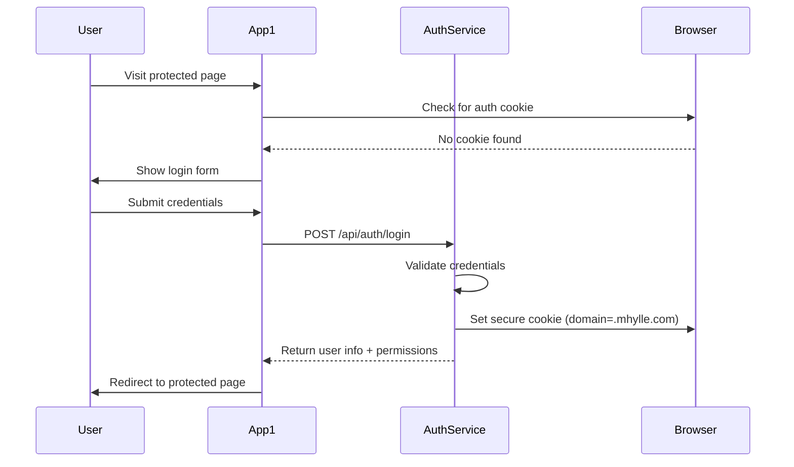
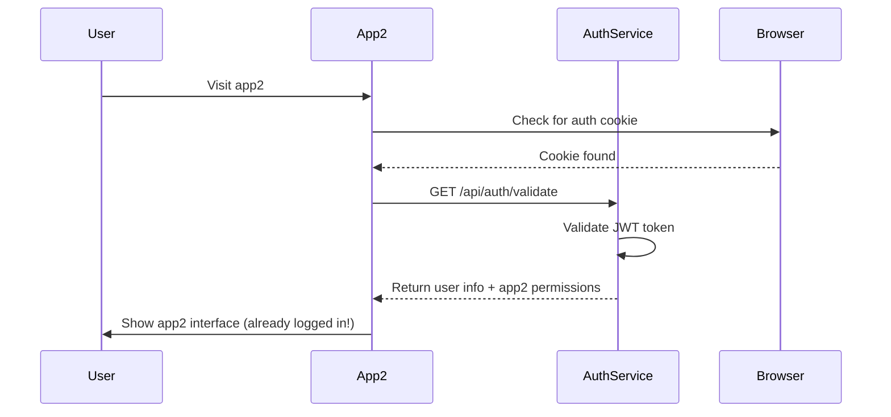

# Authentication Service Architecture

## Overview

The authentication service provides centralized user authentication and authorization for the multi-application hosting platform. It uses a cookie-based SSO approach to eliminate the need for shared libraries while maintaining security and user experience.

## System Architecture

```
┌─────────────────┐    ┌─────────────────┐    ┌─────────────────┐
│   example-app1  │    │   example-app2  │    │   auth-service  │
│                 │    │                 │    │                 │
│ ┌─────────────┐ │    │ ┌─────────────┐ │    │ ┌─────────────┐ │
│ │ Login UI    │ │    │ │ Login UI    │ │    │ │ Auth API    │ │
│ │ (~50 lines) │ │    │ │ (~50 lines) │ │    │ │ (Full Logic)│ │
│ └─────────────┘ │    │ └─────────────┘ │    │ └─────────────┘ │
│                 │    │                 │    │                 │
└─────────────────┘    └─────────────────┘    └─────────────────┘
         │                       │                       │
         └───────────────────────┼───────────────────────┘
                                 │
                    ┌─────────────────┐
                    │ Domain Cookie   │
                    │ .mhylle.com     │
                    │ (SSO Token)     │
                    └─────────────────┘
```

## Core Components

### 1. Auth Service (Backend Only)
- **Location**: `/auth-service/`
- **Technology**: NestJS 11 + TypeORM + PostgreSQL
- **Database**: `auth_db` in shared PostgreSQL instance
- **Endpoints**: `/api/auth/*`
- **Responsibilities**:
  - User authentication (login/logout)
  - JWT token generation and validation
  - Cookie management for SSO
  - User and role management
  - Access control validation

### 2. Application Integration (No Shared Code)
Each application implements minimal auth code (~50 lines):
- Login form UI
- Cookie validation on app startup
- Auth guard for protected routes
- HTTP interceptor for API calls

### 3. Database Schema

```sql
-- Core user table
users (
  id UUID PRIMARY KEY,
  email VARCHAR UNIQUE NOT NULL,
  password_hash VARCHAR NOT NULL,
  first_name VARCHAR,
  last_name VARCHAR,
  is_active BOOLEAN DEFAULT true,
  created_at TIMESTAMP DEFAULT NOW(),
  updated_at TIMESTAMP DEFAULT NOW()
);

-- Multi-tenant role assignments
user_app_roles (
  id UUID PRIMARY KEY,
  user_id UUID REFERENCES users(id) ON DELETE CASCADE,
  app_id VARCHAR NOT NULL, -- 'app1', 'app2', etc.
  role VARCHAR NOT NULL,   -- 'admin', 'user', 'viewer'
  granted_at TIMESTAMP DEFAULT NOW(),
  granted_by UUID REFERENCES users(id),
  UNIQUE(user_id, app_id, role)
);

-- Audit log (optional)
auth_events (
  id UUID PRIMARY KEY,
  user_id UUID REFERENCES users(id),
  event_type VARCHAR NOT NULL, -- 'login', 'logout', 'role_change'
  app_id VARCHAR,
  ip_address INET,
  user_agent TEXT,
  created_at TIMESTAMP DEFAULT NOW()
);
```

## Authentication Flow

### 1. Initial Login


### 2. Cross-App Navigation (SSO)


## Security Features

### 1. Cookie Security
```javascript
// Auth service sets secure cookie
response.cookie('auth_token', jwtToken, {
  domain: '.mhylle.com',     // Available to all subdomains
  path: '/',                 // Available to all paths
  httpOnly: true,           // Prevents XSS attacks
  secure: true,             // HTTPS only
  sameSite: 'strict',       // CSRF protection
  maxAge: 24 * 60 * 60 * 1000 // 24 hours
});
```

### 2. JWT Token Structure
```json
{
  "sub": "user-uuid",
  "email": "user@example.com",
  "apps": ["app1", "app2"],
  "roles": {
    "app1": ["admin"],
    "app2": ["user"]
  },
  "iat": 1640908800,
  "exp": 1640995200
}
```

### 3. Password Security
- bcrypt hashing with 12+ salt rounds
- Password complexity requirements
- Rate limiting on login attempts
- Account lockout after failed attempts

## Deployment Architecture

### 1. Service Deployment
- **Auth Service**: Separate Docker container
- **Database**: Shared PostgreSQL with dedicated `auth_db`
- **Routing**: Nginx forwards `/api/auth/*` to auth service
- **Health Checks**: `/api/auth/health` endpoint

### 2. App Integration
Each app includes minimal code:
```typescript
// Simple auth service (~50 lines total)
class AuthService {
  async checkSession(): Promise<UserInfo | null> {
    const response = await fetch('/api/auth/validate');
    return response.ok ? await response.json() : null;
  }
  
  async login(email: string, password: string): Promise<UserInfo> {
    const response = await fetch('/api/auth/login', {
      method: 'POST',
      headers: { 'Content-Type': 'application/json' },
      body: JSON.stringify({ email, password })
    });
    if (!response.ok) throw new Error('Login failed');
    return await response.json();
  }
  
  async logout(): Promise<void> {
    await fetch('/api/auth/logout', { method: 'POST' });
  }
}
```

## Benefits of This Architecture

### 1. No Shared Dependencies
- ✅ Each app is completely independent
- ✅ No npm package versioning issues
- ✅ No complex build processes
- ✅ Clean GitHub Actions deployment

### 2. Excellent User Experience
- ✅ Single sign-on across all applications
- ✅ Seamless navigation between apps
- ✅ Consistent authentication state

### 3. Security Best Practices
- ✅ HTTP-only cookies prevent XSS
- ✅ CSRF protection via SameSite
- ✅ Centralized security logic
- ✅ Secure token management

### 4. Operational Excellence
- ✅ Independent service deployment
- ✅ Horizontal scaling capability
- ✅ Clear separation of concerns
- ✅ Simple monitoring and debugging

## Trade-offs and Considerations

### Advantages
- Complete decoupling of applications
- Browser-native token sharing
- Technology-agnostic integration
- Simple deployment model

### Disadvantages
- Small amount of code duplication (~50 lines per app)
- Requires coordination for auth UI consistency
- Cookie-based approach has domain limitations

## Future Enhancements

1. **Multi-Factor Authentication**: Add 2FA/MFA support
2. **Social Login**: Google, GitHub, etc. integration
3. **SAML/OIDC**: Enterprise identity provider support
4. **Advanced Roles**: Hierarchical permission system
5. **Session Management**: Concurrent session limits
6. **Audit Dashboard**: Real-time auth event monitoring